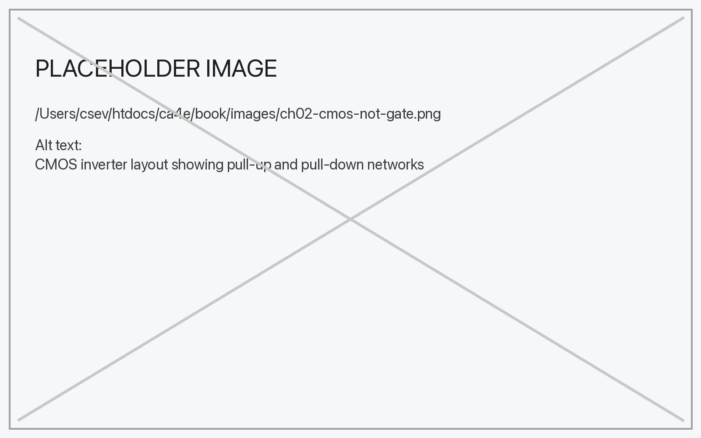

# CA4E Book Build (Pandoc + XeLaTeX)

This project builds a book from Markdown chapters into PDF, EPUB, and HTML formats using Pandoc and XeLaTeX.

## Prerequisites

### macOS

1. **Install Pandoc** (required for all formats):
   ```bash
   brew install pandoc
   ```

2. **Install MacTeX** (required for PDF generation):
   ```bash
   brew install --cask mactex
   ```
   
   Note: MacTeX is a large download (~4GB). After installation, you may need to add it to your PATH:
   ```bash
   export PATH="/usr/local/texlive/2025/bin/universal-darwin:$PATH"
   ```
   
   Alternatively, you can install BasicTeX (smaller, ~100MB) if you don't need all LaTeX packages:
   ```bash
   brew install --cask basictex
   ```

3. **Verify installations**:
   ```bash
   pandoc --version
   xelatex --version
   ```

### Linux

1. **Install Pandoc**:
   ```bash
   # Ubuntu/Debian
   sudo apt-get install pandoc
   
   # Fedora/RHEL
   sudo dnf install pandoc
   ```

2. **Install TeX Live** (includes XeLaTeX):
   ```bash
   # Ubuntu/Debian
   sudo apt-get install texlive-xetex texlive-fonts-recommended
   
   # Fedora/RHEL
   sudo dnf install texlive-xetex texlive-collection-fontsrecommended
   ```

## Build Scripts

The project includes several build scripts for different use cases:

### Quick Build (No Index)

For quick testing and iteration, build PDF without index (single-pass, faster):

```bash
./build-pdf.sh
```

### Full PDF Build (With Index)

Build PDF with full index (multi-pass, slower but complete):

```bash
./build-pdf.sh --index
```

### EPUB Build

Build EPUB format. If PDF doesn't exist, it will build PDF first:

```bash
./build-epub.sh
```

### Build Everything

Build all formats including PDF with index:

```bash
./build.sh
```

## Output Files

All outputs appear in the `build/` directory:
- `build/ca4e.pdf` - Print-ready PDF with index
- `build/ca4e.epub` - EPUB ebook format
- `build/ca4e.html` - Standalone HTML (if using build-html.sh)

## Project Structure

- `chapters/` - Markdown chapter files (ch01-*.md, ch02-*.md, etc.)
- `images/` - Image files referenced in chapters
- `templates/` - LaTeX template for PDF generation
- `styles/` - CSS styles for HTML output
- `build/` - Generated output files

## Adding Chapters

Drop new chapters into `chapters/` as `ch03-*.md`, `ch04-*.md`, etc.
The build scripts include them automatically in filename order.

## Images

Put images in `images/` and reference them in Markdown:

```markdown

```

You can control image height using Pandoc attributes:

```markdown
{height=300px}
```

Pandoc will embed images into PDF/HTML/EPUB automatically.

## PDF Configuration

### Trim Size & Margins

The PDF template is in `templates/kdp-6x9.tex`.
Tweak geometry there if you change trim size or want different margins.

### Fonts

The PDF template uses TeX Gyre fonts by default. If you have MacTeX installed, these fonts are included. Otherwise, the template will fall back to system fonts.

To use different fonts, update `templates/kdp-6x9.tex`:

```latex
\setmainfont{Your Font Name}
```

## Troubleshooting

### "pandoc not found"
Install Pandoc: `brew install pandoc` (macOS) or use your Linux package manager.

### "xelatex not found"
Install MacTeX or TeX Live. On macOS: `brew install --cask mactex`

### LaTeX errors during PDF build
- Clean the build directory: `rm -rf build/*`
- Rebuild: `./build-pdf.sh --index`

### Index not appearing
Make sure you're using the `--index` flag: `./build-pdf.sh --index`
